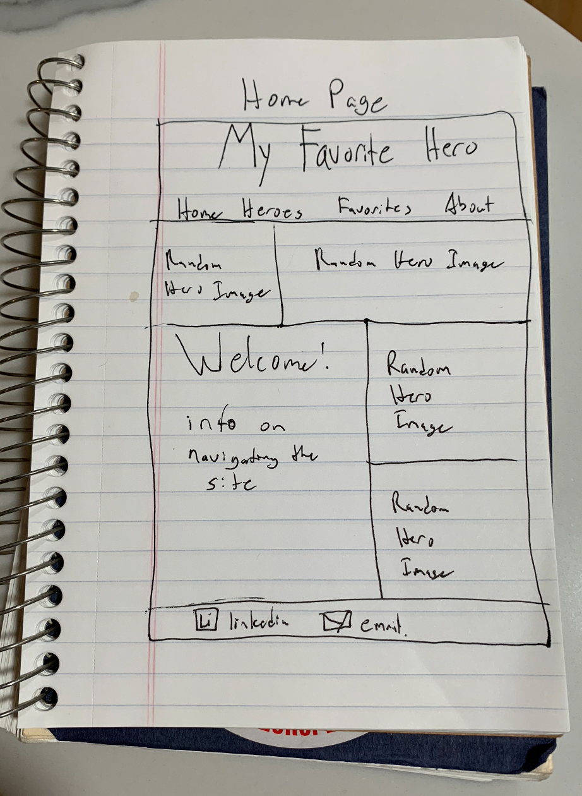
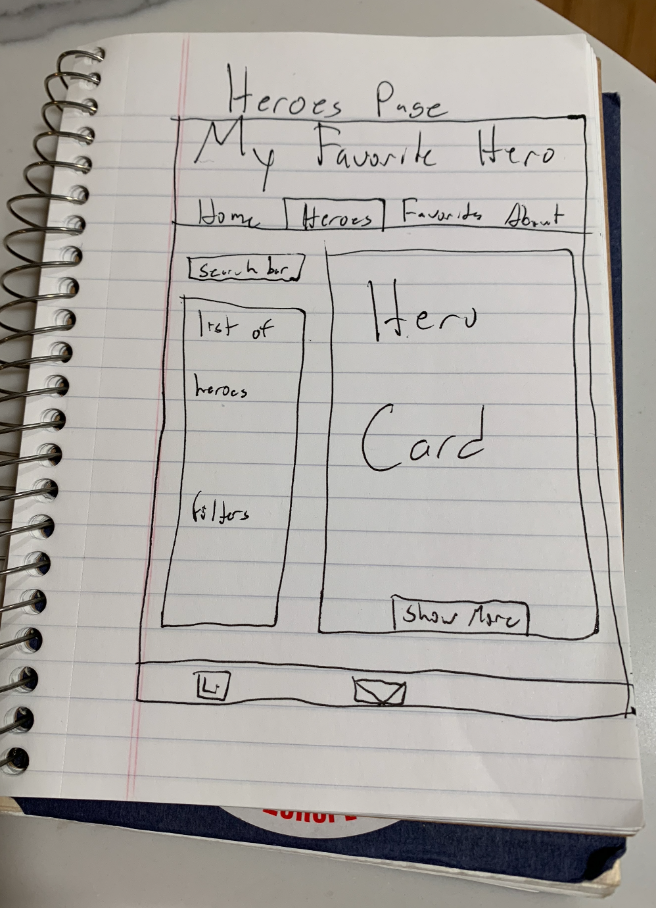

## **My Favorite Hero**

## App Screenshots

## API Used

https://superheroapi.com/

## Technologies Used

- React
- CSS
- JavaScript
- Netlify
- imgur.com

## Installation

1. Fork and clone down the repository to your machine.
2. cd into the repo
3. Open in VScode by running `code .` in your terminal
4. Run `npm i` in your terminal
5. Run `npm start` in your terminal

## User Stories

### MVP

- As a user, I want my site to have access to a search bar so I can find a specific hero I want information on.
- As a user, I want my site to have navigation tools so I can display more information about a specific hero in its own component.
- As a user, I want my site to have a crisp, clean aesthetic so that it allows easy navigation between the different components.
- As a user, I want my site to be able to display the images of the heroes so I have a visual reference for them.

### Stretch Goals

- As a user, I want my site to be able to generate a random hero so I can learn about heroes they may have never heard of.

- As a user, I would like to have an option of where I can learn more on a specific hero so I can access more information.

## Wire Frames

### Unsolved Problems / Major Hurdles

- This was my first encounter with a bigger application using third-party APIs so that was interesting getting used to. The hurdles that I was facing in the beginning with the images not showing and 503 errors was a great learning experience for me and a good challenge to find new solutions. With that being said, these problems have been fixed and addressed.

### Attributes/Thank You

First, I would like to continue to thank my instructors and classmates at GA for all of their input and guidance. For my first React App, I'm very happy to see my idea come to fruition! I also want to thank my fiancé for continuing to be my 'Rubberduck' while I worked through this! 'Til next time!

**Reference List:**

- superherodb.com

- superheroapi.com

- memegenerator.net

- https://www.codegrepper.com/code-examples/css/how+to+raise+image+when+hover

- https://medium.com/@jenniferdobak/the-public-folder-and-favicons-in-create-react-app-8dc2cc1d492b

- https://realfavicongenerator.net/
